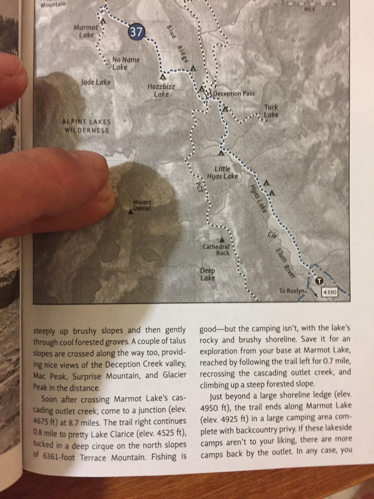

Nice late fall jaunt along Cle Elum River into the Alpine Lakes Wilderness to Marmot Lake near
Deception Pass then along PCT past Cathedral Rock to Deep Lake & back down.

Enjoyed solitude and decent weather in the usually crowded Alpine Lakes area.
Experienced some snowfall on the 2nd night and hiked through some snow around
Cathedral pass, but able to navigate with map & compass just fine.

First night at Marmot Lake & 2nd night at Deep Lake.  Mount Daniel over the
lake looked foreboding with its snow & ice.

### Fun facts

Guide book warned about having to cross a bridgeless river in late and early
seasons.  Jetta wagon made it fine past that, but after running into deeply
rutted and muddy road, quickly got stuck in mud trying to go around through
brush!  Luckily a few truck driving locals came around and whinched the car to
safety.  Parked it there and hiked the 2 miles to the trailhead.

Hammock w/ underquilt & tarp worked perfectly in windy/rainy conditions

Headlamp ran out of batteries but plenty of moonlight for making camp.

