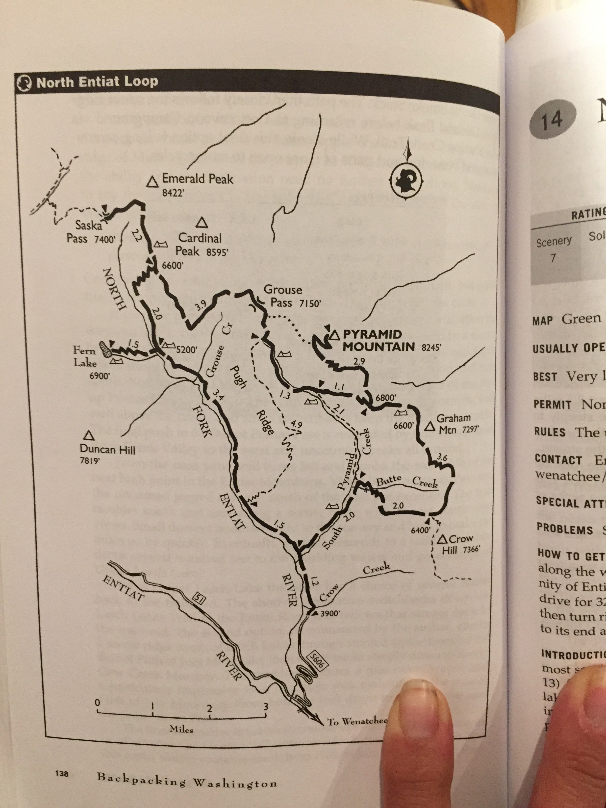

A short one nighter of what was supposed to be a 2 night loop in the North
Entiat River area.  Erik H. & I were both unprepared for the snowy & rainy
conditions.  Items missing: snow gear, snow boots, 4-season tent, extra wool socks, etc.

After a wet 2 mile hike through deep & wet snow, decided to make camp at
a trail junction to await better weather.  Spent a good 2 hours building
a fire, then another 2 trying to enjoy its heat under a tarp with increasingly
hard rain.

Attempted to pitch tents on the driest patch of snow available.

In the morning, my container holding stove was frozen shut.  Luckily Erik's was
functional.

Without visible trails and poor maps, Decided to call it a trip instead of
attempting to navigate by compass in unknown snowy terrain.  Weather warmed
nicely on the way out and managed to get good views of the Larches in fall
colors.

A fun experience and good learning opportunity.

