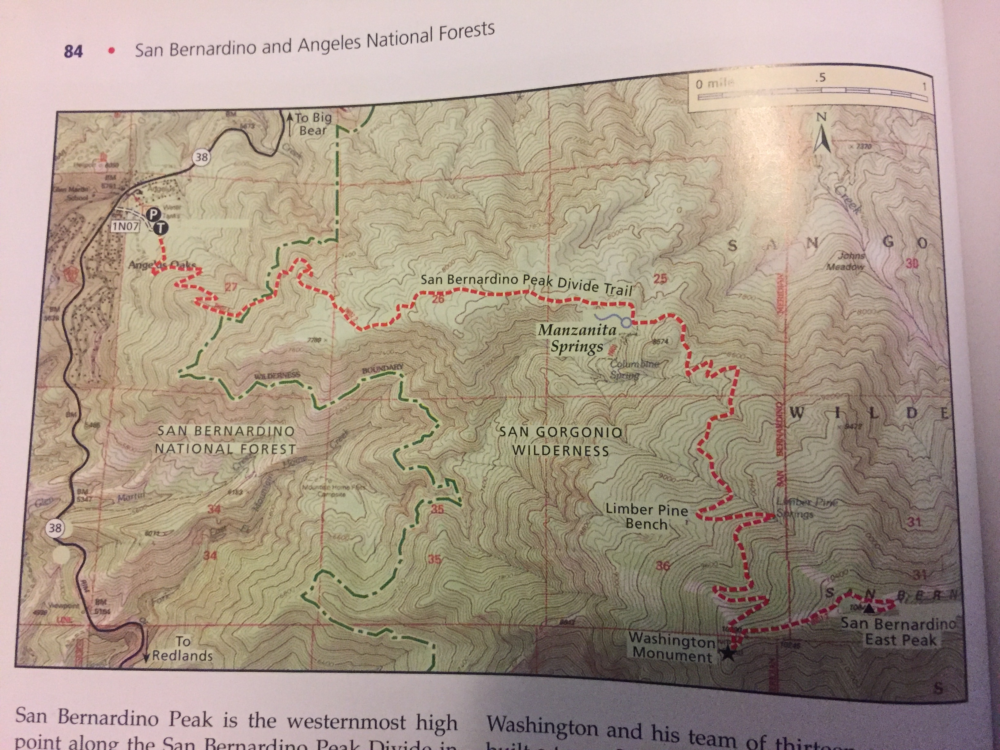

A 10K+ foot peak just out of town without the normal summer crowds

Pleasant winter hike with sweeping views of the LA valley

Microspikes were plenty but had ice axe in case

Night not cold and had great sunset views from hammock

