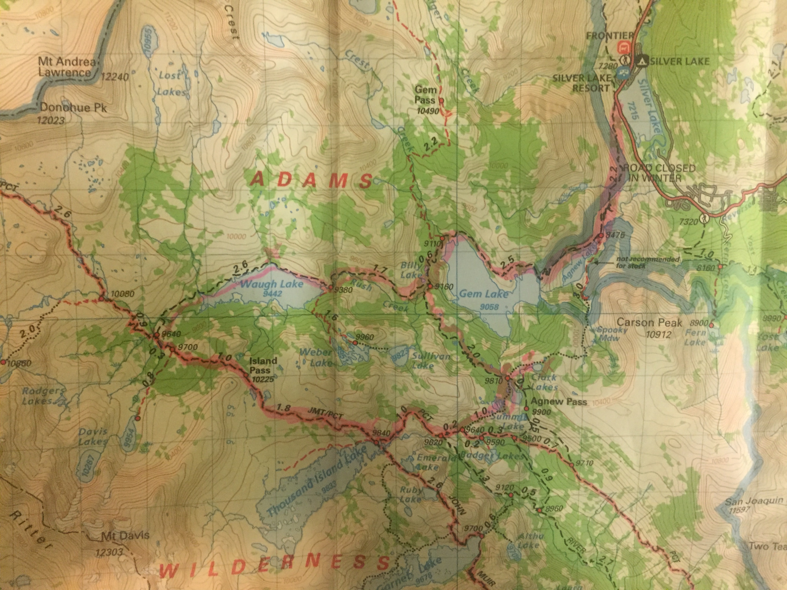

Arduous but ultimately very rewarding late fall hike through Mammoth high
country.  Snow travel kept it challenging but beautiful.

Start at Silver Lake resort trailhead and steadily up past mining car track
that climbs *very* steeply up to a power station at Agnew Lake.  More climbing
above Agnew Lake and along big Gem Lake.  Snowpack deepens towards frozen Waugh
Lake with sweeping views up to Island Pass above.

Next day hike to Island Pass was a real calorie burner without snowshoes!
Knee-to-thigh deep snow at times and steady climb to 10K+ feet.  Worth it for
serenity & pano views from the pass.

Thousand Island Lake is a real wonder esp. this time of year where mostly
frozen.  Sunset on Banner Peak is a sight.

Beautiful sunrise pinks and onwards & up x-country to Clark lakes, taking
shortcut around Agnew Pass.   *Very* strong winds made raising tent a 2+ hour
ordeal but it finally stood up.  Winds continued all night & until back down to
Gem Lake completing loop.

### Fun facts

Had snowshoes but decided not to bring them :(

Broke another trecking pole during tumble in snow

Coyotes barking at Thousand Island Lake at night was a little scary

Visited Mono Lake on the way back

<iframe
src='https://www.gaiagps.com/public/FD5XgTaM12DRn0ZZTcW2VnQH?embed=True'
style='border:none; overflow-y: hidden; background-color:white; min-width:
320px; max-width:420px; width:100%; height: 420px;' scrolling='no'
seamless='seamless'></iframe>
